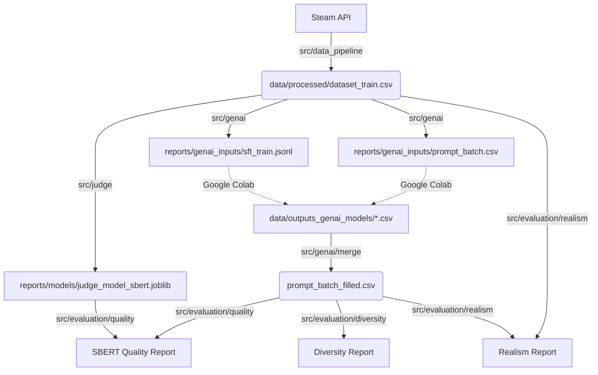

# Complete Project Documentation: Steam Reviews GenAI

This project is a comprehensive Machine Learning and Generative AI pipeline. It is structured into 4 major phases:

1.  **Data Engineering**: Collection and preparation of Steam data.
2.  **AI Judge**: Training classifiers (SBERT & TF-IDF) to evaluate quality.
3.  **GenAI**: Fine-tuning an LLM and generating reviews.
4.  **Evaluation**: Analysis of quality, diversity, and realism of generated texts.

---

## Project Structure

Here is the overall file organization:

```text
steam-project/
├── data/                      # Data storage
│   ├── raw/                   # Raw JSON/CSV from Steam API
│   ├── processed/             # Cleaned data (dataset_train.csv, titles.csv)
│   └── outputs_gen_ai_models/ # Files received from Colab
├── evaluation/                # Outputs specific to evaluation scripts
│   ├── csv/                   # Intermediate results (SBERT, manual JSON)
│   └── prompts/               # Text files for external LLM evaluation
├── reports/                   # Artifacts and Results
│   ├── models/                # Judge models (.joblib)
│   ├── genai_inputs/          # Input files for LLM (prompts, jsonl)
│   └── results/               # Performance reports (Markdown)
├── src/                       # Source Code
│   ├── config.py              # Global configuration
│   ├── utils.py               # Utilities (SBERT, etc.)
│   ├── data/                  # ETL Pipeline (Extract-Transform-Load)
│   ├── judge/                 # Classification (The Judge)
│   ├── genai/                 # GenAI Pipeline (Training & Inference)
│   └── evaluation/            # Analysis scripts (Quality, Diversity, Realism)
```

---

## Phase 1: Data Pipeline

This phase transforms raw data from the internet into a clean dataset for Machine Learning.

### Step 1: Collection (`01_collect.py`)

Downloads reviews and game titles from the Steam API.

*   **Commands:**
    ```bash
    python src/data/01_collect.py train
    python src/data/01_collect.py validation
    ```
*   **Outputs:**
    *   `data/raw/reviews_raw_train.csv`
    *   `data/processed/titles_train.csv` (Game titles)

### Step 2: Dataset Construction (`02_process.py`)

Cleans texts, merges with titles, and converts votes (recommended/not) into ratings (3/10 or 9/10).

*   **Commands:**
    ```bash
    python src/data/02_process.py train
    python src/data/02_process.py validation
    ```
*   **Outputs:**
    *   `data/processed/dataset_train.csv`: **The master file**.
    *   `data/processed/dataset_val.csv`: For final tests.

---

## Phase 2: Judge Training

Creating an AI capable of determining if a review is positive or negative. We train two versions to compare evaluation approaches.

### Step 3: Training (`03_train.py`)

#### Option A: SBERT Model (Recommended)
Captures the semantics (meaning) of sentences.

*   **Command:**
    ```bash
    python src/judge/03_train.py --model sbert
    ```
*   **Output:** `reports/models/judge_model_sbert.joblib`

#### Option B: TF-IDF Model (Baseline)
Based on keywords. Useful for checking if the LLM "cheats" by just using positive words.

*   **Command:**
    ```bash
    python src/judge/03_train.py --model tfidf
    ```
*   **Output:** `reports/models/judge_model_tfidf.joblib`

---

## Phase 3: Generative AI (Local & Colab)

This phase is hybrid: local preparation, training/generation on Google Colab (GPU), then back to local for evaluation.

### Step 4: Data Preparation (Local)

#### A. Creating "Zero-Shot" Prompts (`04_generate_prompts.py`)
Generates the instructions that the LLM must follow (Naive vs Engineered).

*   **Command:**
    ```bash
    python src/genai/04_generate_prompts.py
    ```
*   **Output:** `reports/genai_inputs/prompt_batch.csv`

#### B. Preparing the Fine-Tuning Dataset (`05_prepare_training.py`)
Transforms real reviews into JSONL format for retraining the LLM (Instruction Tuning).

*   **Command:**
    ```bash
    python src/genai/05_prepare_training.py
    ```
*   **Output:** `reports/genai_inputs/sft_train.jsonl`

### Step 5: Execution on Google Colab (GPU required)

Use the files generated in Step 4.

#### Notebook 1: Training (LoRA Fine-Tuning)
1.  **Upload:** Place `reports/genai_inputs/sft_train.jsonl` on Colab.
2.  **Training:** Run the notebook to fine-tune `TinyLlama-1.1B`.
3.  **Save:** Retrieve the LoRA adapter folder to your Google Drive.

#### Notebook 2: Inference & Generation
1.  **Upload:** Place `reports/genai_inputs/prompt_batch.csv` on Colab.
2.  **Generation:** Run the notebook to generate the 3 CSV files:
    *   `generated_reviews_naive.csv`
    *   `generated_reviews_engineered.csv`
    *   `generated_reviews_finetuned.csv`
3.  **Download:** Download these 3 files to your local computer.

### Step 6: Consolidation (Local)

#### C. Merging Results (`06_merge_outputs.py`)
1.  **Action:** Place the 3 CSV files from Colab in `data/outputs_genai_models/`.
2.  **Command:**
    ```bash
    python src/genai/06_merge_outputs.py
    ```
3.  **Output:** `reports/genai_inputs/prompt_batch_filled.csv`

---

## Phase 4: Evaluation Suite

This phase uses scripts located in `src/evaluation/` to analyze the quality, diversity, and realism of generated reviews.

**Prerequisites:**
```bash
pip install pandas numpy requests tqdm scikit-learn sentence-transformers tabulate
```

### Step 7: Quality Evaluation & LLM-as-a-Judge (`08_evaluate_quality.py`)

This script generates prompts for an external "AI Judge" (e.g., GPT-4) to detect hallucinations or errors, and prepares comparison with the internal SBERT Judge.

**Syntax:**
```bash
python src/evaluation/08_evaluate_quality.py [TASK]
```

**Available Tasks:**

| Argument | Description | Outputs (in `evaluation/`) |
| :--- | :--- | :--- |
| `all` | Executes all prompt generations + SBERT preparation. | All files below. |
| `hallucination` | Prompts to detect invented facts. | `prompts/batch_hallucination_*.txt` |
| `structure` | Prompts to verify structural rules. | `prompts/batch_structure_*.txt` |
| `spoiler` | Prompts to detect narrative spoilers. | `prompts/batch_spoiler_*.txt` |
| `sentiment` | Prompts to verify rating/text alignment. | `prompts/batch_sentiment_naive.txt` |
| `sbert_prep` | Prepares sample for SBERT evaluation. | `prompts/prompt_judge_sbert_300.txt`<br>`csv/sbert_subset_300_stratified.csv` |
| `sbert_eval` | Compares SBERT predictions vs external Judge. | `csv/sbert_evaluation_results_300.csv` |

**Specific Workflow: SBERT Evaluation**
1.  Run `python src/evaluation/08_evaluate_quality.py sbert_prep`.
2.  Copy the content of `evaluation/prompts/prompt_judge_sbert_300.txt` into ChatGPT/Claude.
3.  Retrieve **only** the JSON response and save it as `evaluation/csv/judge_labels_300.json`.
4.  Run `python src/evaluation/08_evaluate_quality.py sbert_eval`.

### Step 8: Diversity Evaluation (`09_evaluate_diversity.py`)

Measures vocabulary richness (n-grams) and semantic redundancy between generated reviews to check if the model is repetitive.

**Complete example:**
```bash
python src/evaluation/09_evaluate_diversity.py \
  --input reports/genai_inputs/prompt_batch_filled.csv \
  --inter-sim \
  --save \
  --prefix "Naive vs Engineered Comparison"
```

**Key Arguments:**
*   `--inter-sim`: Activates SBERT semantic analysis (recommended).
*   `--save`: Adds results to the report `reports/results/results_diversity.md`.
*   `--prefix`: Experiment name in the report.

### Step 9: Realism & Plagiarism Evaluation (`10_evaluate_realism.py`)

Compares generated reviews with a base of "real" Steam reviews (Ground Truth) to measure semantic proximity and verify absence of pure plagiarism.

**Complete example:**
```bash
python src/evaluation/10_evaluate_realism.py \
  --gen reports/genai_inputs/prompt_batch_filled.csv \
  --real data/raw/reviews_raw_train.csv \
  --max-real 2000 \
  --save \
  --prefix "Realism Test V1"
```

**Key Arguments:**
*   `--gen`: Generated reviews file.
*   `--real`: Real reviews file.
*   `--max-real`: Limits the number of real reviews used (recommended: 2000).
*   `--save`: Adds results to the report `reports/results/results_realism.md`.

---

## Data Flow Summary

