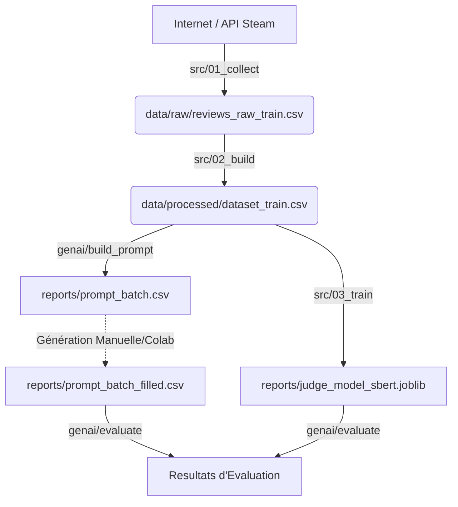

# Documentation du Projet : Steam Reviews GenAI

Ce projet est un pipeline complet de Machine Learning et de Generative AI. Il permet de :

1. **Collecter** des données réelles de Steam.
2. **Entraîner** un "Juge" (Classifieur) capable de noter la qualité d'une review.
3. **Préparer** le terrain pour générer de fausses reviews via une IA (Fine-tuning).

---

## Structure des Dossiers (Générée automatiquement)

Une fois le pipeline exécuté, vos dossiers ressembleront à ceci :

```text
steam-project/
├── data/
│   ├── raw/           # Données brutes (JSON/CSV venant de l'API)
│   └── processed/     # Données nettoyées, fusionnées et prêtes pour le ML
├── reports/           # Modèles entraînés (.joblib), métriques et fichiers de prompts
├── src/               # Scripts de collecte et d'entraînement du Juge
└── genai/             # Scripts pour la génération et l'évaluation LLM
```

---

## Phase 1 : Pipeline de Données (`src/`)

Cette phase transforme les données brutes d'Internet en un dataset propre.

### Étape 1 : Collecte (`01_collect_data.py`)

Télécharge les reviews et les titres des jeux depuis l'API Steam.

* **Commandes :**

```bash
python src/01_collect_data.py train
python src/01_collect_data.py validation
```

* **Inputs :**

  * Liste d'IDs de jeux définie dans `src/config.py`.
  * Internet (API Steam).

* **Outputs :**

  * `data/raw/reviews_raw_train.csv` : Reviews brutes pour l'entraînement.
  * `data/processed/games_train.csv` : Titres des jeux d'entraînement.
  * *(Idem pour validation avec le suffixe `_val.csv`)*.

### Étape 2 : Construction du Dataset (`02_build_dataset.py`)

Nettoie les textes (suppression des doublons, textes trop courts), fusionne avec les titres, et convertit le vote (recommandé/non) en note (3/10 ou 9/10).

* **Commandes :**

```bash
python src/02_build_dataset.py train
python src/02_build_dataset.py validation
```

* **Inputs :**

  * `data/raw/reviews_raw_*.csv`
  * `data/processed/games_*.csv`

* **Outputs :**

  * `data/processed/dataset_train.csv` : **Le fichier maître** pour tout le projet.
  * `data/processed/dataset_val.csv` : Pour tests sur des jeux jamais vus pendant l’entraînement.

---

## Phase 2 : Entraînement du Juge (`src/`)

Cette phase crée une IA capable de dire si une review est positive ou négative.
Le modèle sera évalué uniquement sur la **validation finale**, qui contient des jeux **jamais vus** par le modèle.

### Étape 3 : Entraînement (`03_train_judge.py`)

Le script supporte deux modèles : TF-IDF (baseline) ou SBERT (recommandé).
Un split interne 80/20 par jeux est utilisé **uniquement pour calculer le seuil F1 optimal**. Ensuite, le modèle est ré-entraîné sur tout le dataset TRAIN.

#### Option A : Modèle TF-IDF (Baseline)

Rapide, basé sur les mots-clés.

* **Commande :**

```bash
python src/03_train_judge.py --model tfidf
```

* **Inputs :** `data/processed/dataset_train.csv`
* **Outputs :** `reports/judge_model_tfidf.joblib`

#### Option B : Modèle SBERT (Recommandé)

Comprend le sens des phrases (sémantique), plus fiable pour l’évaluation de textes générés.

* **Commande :**

```bash
python src/03_train_judge.py --model sbert
```

* **Inputs :** `data/processed/dataset_train.csv`
* **Outputs :** `reports/judge_model_sbert.joblib`

> Le **seuil F1 macro** est calculé automatiquement sur un split interne (80/20 par jeux) et utilisé pour l’évaluation finale sur le dataset de validation. Le seuil est sauvegardé avec le modèle.

---

## Phase 3 : Generative AI (`genai/`)

Cette phase prépare les instructions pour l'IA générative et évalue le résultat.

### Étape 4 : Préparation des Prompts & Fine-Tuning

#### A. Création des Prompts "Zero-Shot"

Génère un CSV contenant des instructions pour l’IA (ex: *"Write a review for Elden Ring..."*).

* **Script :** `python genai/build_prompt_batch.py`
* **Input :** `data/processed/dataset_train.csv`
* **Output :** `reports/prompt_batch.csv`

#### B. Préparation du Dataset de Fine-Tuning (SFT)

Prépare des fichiers JSONL pour ré-entraîner un modèle sur le style Steam.

* **Script :** `python genai/make_dataset.py`
* **Input :** `data/processed/dataset_train.csv`
* **Output :** `reports/sft_train.jsonl`

### Étape 5 : Génération (Externe)

Remplir la colonne `generated_text` avec les reviews générées par l’IA (manuellement ou via Colab).

* **Output attendu :** `reports/prompt_batch_filled.csv`

### Étape 6 : Évaluation Finale

Le "Juge" (SBERT ou TF-IDF) note vos reviews générées.

* **Script :** `python genai/evaluate_generations.py`
* **Inputs :**

  * `reports/prompt_batch_filled.csv`
  * `reports/judge_model_sbert.joblib`
* **Outputs :**

  * `reports/generation_eval_summary.csv` : Tableau des scores (consigne, positivité, etc.)

---

## Résumé du Flux de Données

