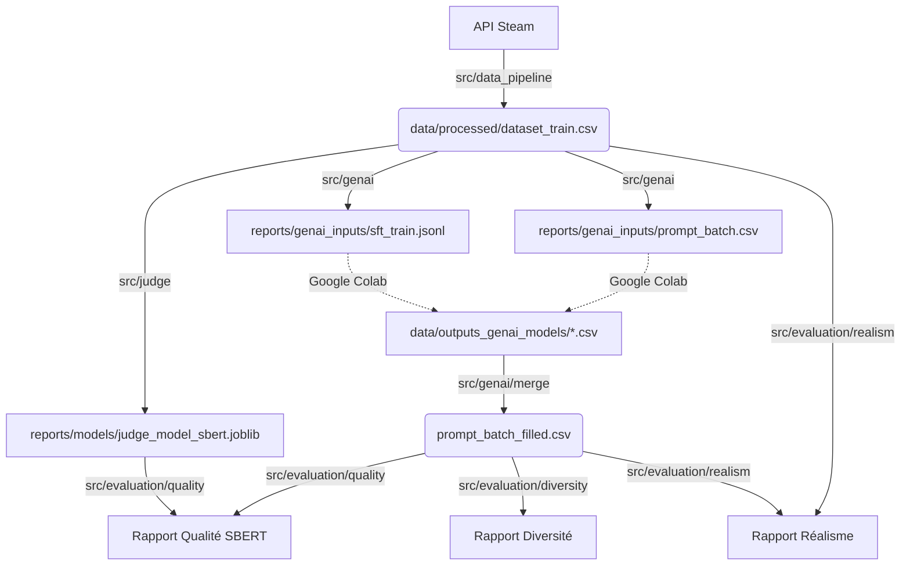

# Documentation Complète du Projet : Steam Reviews GenAI

Ce projet est un pipeline complet de Machine Learning et d'IA Générative. Il est structuré en 4 grandes phases :

1.  **Data Engineering** : Collecte et préparation des données Steam.
2.  **Juge IA** : Entraînement de classifieurs (SBERT & TF-IDF) pour évaluer la qualité.
3.  **GenAI** : Fine-tuning d'un LLM et génération de reviews.
4.  **Évaluation** : Analyse de la qualité, de la diversité et du réalisme des textes générés.

---

## Structure du Projet

Voici l'organisation globale des fichiers :

```text
steam-project/
├── data/                      # Stockage des données
│   ├── raw/                   # JSON/CSV bruts de l'API Steam
│   ├── processed/             # Données nettoyées (dataset_train.csv, titles.csv)
│   └── outputs_gen_ai_models/ # Réception des fichiers venant de Colab
├── evaluation/                # Sorties spécifiques aux scripts d'évaluation
│   ├── csv/                   # Résultats intermédiaires (SBERT, JSON manuel)
│   └── prompts/               # Fichiers textes pour évaluation par LLM externe
├── reports/                   # Artefacts et Résultats
│   ├── models/                # Modèles du Juge (.joblib)
│   ├── genai_inputs/          # Fichiers d'entrée pour le LLM (prompts, jsonl)
│   └── results/               # Rapports de performance (Markdown)
├── src/                       # Code Source
│   ├── config.py              # Configuration globale
│   ├── utils.py               # Utilitaires (SBERT, etc.)
│   ├── data/                  # Pipeline ETL (Extract-Transform-Load)
│   ├── judge/                 # Classification (Le Juge)
│   ├── genai/                 # Pipeline GenAI (Entraînement & Inférence)
│   └── evaluation/            # Scripts d'analyse (Qualité, Diversité, Réalisme)
```

---

## Phase 1 : Pipeline de Données

Cette phase transforme les données brutes d'Internet en un dataset propre pour le Machine Learning.

### Étape 1 : Collecte (`01_collect.py`)

Télécharge les reviews et les titres des jeux depuis l'API Steam.

*   **Commandes :**
    ```bash
    python src/data/01_collect.py train
    python src/data/01_collect.py validation
    ```
*   **Outputs :**
    *   `data/raw/reviews_raw_train.csv`
    *   `data/processed/titles_train.csv` (Titres des jeux)

### Étape 2 : Construction du Dataset (`02_process.py`)

Nettoie les textes, fusionne avec les titres, et convertit le vote (recommandé/non) en note (3/10 ou 9/10).

*   **Commandes :**
    ```bash
    python src/data/02_process.py train
    python src/data/02_process.py validation
    ```
*   **Outputs :**
    *   `data/processed/dataset_train.csv` : **Le fichier maître**.
    *   `data/processed/dataset_val.csv` : Pour tests finaux.

---

## Phase 2 : Entraînement du Juge

Création d'une IA capable de dire si une review est positive ou négative. Nous entraînons deux versions pour comparer l'évaluation.

### Étape 3 : Entraînement (`03_train.py`)

#### Option A : Modèle SBERT (Recommandé)
Capture la sémantique (le sens) des phrases.

*   **Commande :**
    ```bash
    python src/judge/03_train.py --model sbert
    ```
*   **Output :** `reports/models/judge_model_sbert.joblib`

#### Option B : Modèle TF-IDF (Baseline)
Se base sur les mots-clés. Utile pour vérifier si le LLM "triche" en utilisant juste des mots positifs.

*   **Commande :**
    ```bash
    python src/judge/03_train.py --model tfidf
    ```
*   **Output :** `reports/models/judge_model_tfidf.joblib`

---

## Phase 3 : Generative AI (Local & Colab)

Cette phase est hybride : préparation en local, entraînement/génération sur Google Colab (GPU), puis retour en local pour l'évaluation.

### Étape 4 : Préparation des Données (Local)

#### A. Création des Prompts "Zero-Shot" (`04_generate_prompts.py`)
Génère les instructions que le LLM devra suivre (Naive vs Engineered).

*   **Commande :**
    ```bash
    python src/genai/04_generate_prompts.py
    ```
*   **Output :** `reports/genai_inputs/prompt_batch.csv`

#### B. Préparation du Dataset de Fine-Tuning (`05_prepare_training.py`)
Transforme les vraies reviews en format JSONL pour ré-entraîner le LLM (Instruction Tuning).

*   **Commande :**
    ```bash
    python src/genai/05_prepare_training.py
    ```
*   **Output :** `reports/genai_inputs/sft_train.jsonl`

### Étape 5 : Exécution sur Google Colab (GPU requis)

Utilisez les fichiers générés à l'étape 4.

#### Notebook 1 : Entraînement (Fine-Tuning LoRA)
1.  **Upload :** Déposez `reports/genai_inputs/sft_train.jsonl` sur le Colab.
2.  **Entraînement :** Lancez le notebook pour fine-tuner `TinyLlama-1.1B`.
3.  **Sauvegarde :** Récupérez le dossier de l'adaptateur LoRA sur votre Google Drive.

#### Notebook 2 : Inférence & Génération
1.  **Upload :** Déposez `reports/genai_inputs/prompt_batch.csv` sur le Colab.
2.  **Génération :** Lancez le notebook pour générer les 3 fichiers CSV :
    *   `generated_reviews_naive.csv`
    *   `generated_reviews_engineered.csv`
    *   `generated_reviews_finetuned.csv`
3.  **Download :** Téléchargez ces 3 fichiers sur votre ordinateur local.

### Étape 6 : Consolidation (Local)

#### C. Fusion des Résultats (`06_merge_outputs.py`)
1.  **Action :** Placez les 3 fichiers CSV du Colab dans `data/outputs_genai_models/`.
2.  **Commande :**
    ```bash
    python src/genai/06_merge_outputs.py
    ```
3.  **Output :** `reports/genai_inputs/prompt_batch_filled.csv`

---

## Phase 4 : Suite d'Évaluation

Cette phase utilise les scripts situés dans `src/evaluation/` pour analyser la qualité, la diversité et le réalisme des reviews générées.

**Pré-requis** :
```bash
pip install pandas numpy requests tqdm scikit-learn sentence-transformers tabulate
```

### Étape 7 : Évaluation de la Qualité & Jugement LLM (`08_evaluate_quality.py`)

Ce script génère des prompts pour qu'un "Juge IA" externe (ex: GPT-4) détecte les hallucinations ou erreurs, et prépare la comparaison avec le Juge SBERT interne.

**Syntaxe :**
```bash
python src/evaluation/08_evaluate_quality.py [TACHE]
```

**Tâches Disponibles :**

| Argument | Description | Sorties (dans `evaluation/`) |
| :--- | :--- | :--- |
| `all` | Exécute toutes les générations de prompts + préparation SBERT. | Tous les fichiers ci-dessous. |
| `hallucination` | Prompts pour détecter les faits inventés. | `prompts/batch_hallucination_*.txt` |
| `structure` | Prompts pour vérifier la règle structurelle. | `prompts/batch_structure_*.txt` |
| `spoiler` | Prompts pour détecter les spoilers narratifs. | `prompts/batch_spoiler_*.txt` |
| `sentiment` | Prompts pour vérifier l'alignement note/texte. | `prompts/batch_sentiment_naive.txt` |
| `sbert_prep` | Prépare l'échantillon pour l'évaluation SBERT. | `prompts/prompt_judge_sbert_300.txt`<br>`csv/sbert_subset_300_stratified.csv` |
| `sbert_eval` | Compare les prédictions SBERT vs Juge externe. | `csv/sbert_evaluation_results_300.csv` |

**Workflow Spécifique : Évaluation SBERT**
1.  Lancer `python src/evaluation/08_evaluate_quality.py sbert_prep`.
2.  Copier le contenu de `evaluation/prompts/prompt_judge_sbert_300.txt` dans ChatGPT/Claude.
3.  Récupérer **uniquement** le JSON de réponse et le sauvegarder sous `evaluation/csv/judge_labels_300.json`.
4.  Lancer `python src/evaluation/08_evaluate_quality.py sbert_eval`.

### Étape 8 : Évaluation de la Diversité (`09_evaluate_diversity.py`)

Mesure la richesse du vocabulaire (n-grams) et la redondance sémantique entre les reviews générées pour vérifier si le modèle se répète.

**Exemple complet :**
```bash
python src/evaluation/09_evaluate_diversity.py \
  --input reports/genai_inputs/prompt_batch_filled.csv \
  --inter-sim \
  --save \
  --prefix "Comparaison Naive vs Engineered"
```

**Arguments Clés :**
*   `--inter-sim` : Active l'analyse sémantique SBERT (recommandé).
*   `--save` : Ajoute les résultats au rapport `reports/results/results_diversity.md`.
*   `--prefix` : Nom de l'expérience dans le rapport.

### Étape 9 : Évaluation du Réalisme & Plagiat (`10_evaluate_realism.py`)

Compare les reviews générées avec une base de "vraies" reviews Steam (Ground Truth) pour mesurer la proximité sémantique et vérifier l'absence de plagiat pur.

**Exemple complet :**
```bash
python src/evaluation/10_evaluate_realism.py \
  --gen reports/genai_inputs/prompt_batch_filled.csv \
  --real data/raw/reviews_raw_train.csv \
  --max-real 2000 \
  --save \
  --prefix "Test de Réalisme V1"
```

**Arguments Clés :**
*   `--gen` : Fichier des reviews générées.
*   `--real` : Fichier des reviews réelles.
*   `--max-real` : Limite le nombre de reviews réelles utilisées (conseillé : 2000).
*   `--save` : Ajoute les résultats au rapport `reports/results/results_realism.md`.

---

## Résumé du Flux de Données

